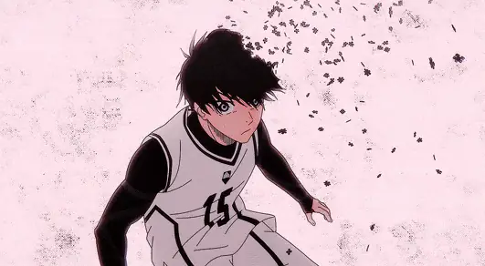

<!-- ═══════════════════ BADGE RAIL ═══════════════════ -->

  
  
  
  
  

<!-- ═══════════════════ HEADER ═══════════════════ -->

<!--  -->

<!-- ═══════════════════ ABOUT ═══════════════════ -->

## 👋 About Me

Fullstack engineer with **6+ years** of experience building and shipping production web applications end-to-end — from pixel-perfect interfaces to the APIs behind them.

|                |                                                                |
| :------------- | :------------------------------------------------------------- |
| **Role**       | Fullstack Engineer                                             |
| **Company**    | PT. Bank Rakyat Indonesia — outsourced via **Entrust Digital** |
| **Education**  | Hacktiv8 Indonesia — _Fullstack JavaScript Immersive_          |
| **Experience** | 6+ years in production web development                         |
| **Focus**      | System design · performance · clean architecture               |
| **Status**     | 🟦 Open to fullstack / frontend opportunities                  |

<!-- ═══════════════════ TECH STACK ═══════════════════ -->

## 🛠️ Tech Stack

**Frontend**  

**Backend & Data**  

**Tools**  

<!-- ═══════════════════ GITHUB STATS ═══════════════════ -->

## 📊 GitHub Stats

<!-- ═══════════════════ CURRENTLY ═══════════════════ -->

## 🎯 What I'm Working On

- 🔭 Building and maintaining banking-scale web applications at **BRI**
- 🌱 Deepening my skills in **system design**, frontend performance, and clean architecture
- 💡 Turning complex, changing requirements into features that ship on schedule
- 🤝 Open to conversations about **fullstack / frontend** roles

<!-- ═══════════════════ CONTACT ═══════════════════ -->

## 📫 Get In Touch

**Have a project or a role in mind? I'd be glad to hear about it.**

 

  

