<!-- ═══════════════════ BADGE RAIL ═══════════════════ -->

  <!-- invisible spacer: lines the badges up with the card's 56/1200 content inset -->
  
  
  
  
  
  

<!-- ═══════════════════ INTRO CARD (banner + about, one block) ═══════════════════ -->

